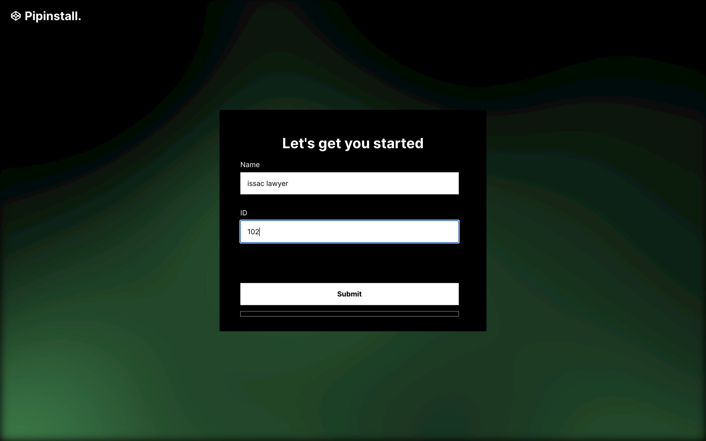
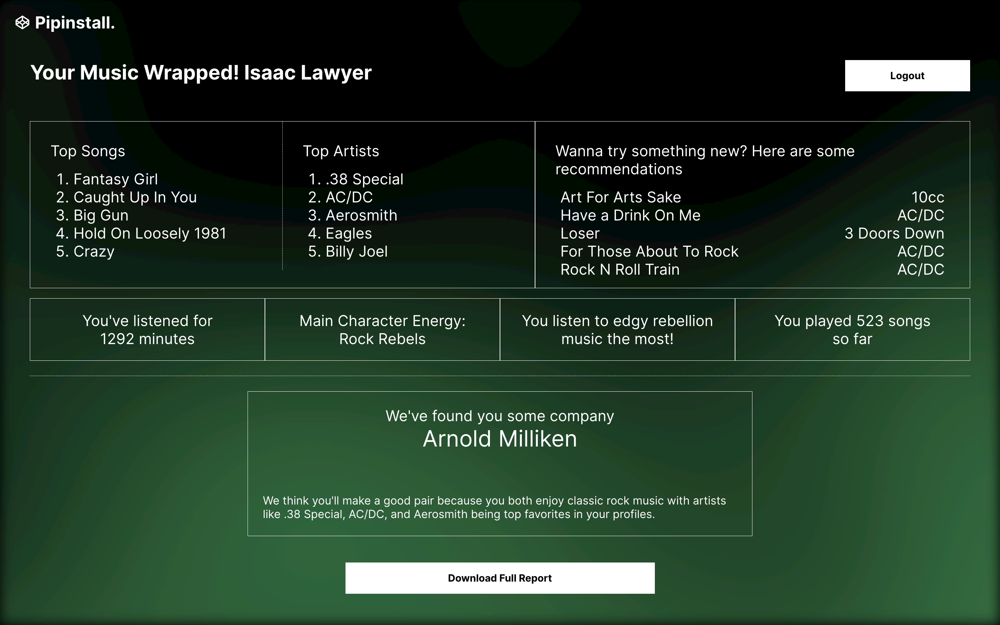

# Music-Based User Matchmaking System

## Introduction

The Music-Based User Matchmaking System is a project aimed at connecting individuals through shared music preferences. In a world where digital interactions often overshadow personal connections, this system leverages music as a universal language to foster genuine relationships. By analyzing user listening habits and preferences, the system provides personalized music recommendations and identifies users with similar tastes, enhancing social connectivity.

## System Architecture

The architecture of this system consists of:

1. **Data Source**: A dataset containing user listening history, track metadata, and demographic information.
2. **Apache Spark**: Utilized for processing large datasets and performing collaborative filtering.
3. **FastAPI**: Serves as the backend framework for handling API requests and integrating with the frontend.
4. **React**: Provides a dynamic and interactive user interface for displaying recommendations and user matches.

## Technologies

- Python
- Apache Spark
- FastAPI
- React
- OpenAI API

## Getting Started

### Prerequisites

- Python 3.x installed locally.
- Node.js and npm installed for the React frontend.
- An OpenAI API Key for generating recommendations.

### Installation Steps

#### 1. Clone the Repository

```bash
git clone https://github.com/yourusername/MusicRecommendationSystem.git
cd MusicRecommendationSystem
```

#### 2. Set Up Backend

Navigate to the backend directory and create a virtual environment:

```bash
cd backend
python -m venv .venv
source .venv/bin/activate  # On Windows use `.venv\Scripts\activate`
```

Install the required packages:

```bash
pip install -r requirements.txt
```

Create a `.env` file in the backend directory with your OpenAI API key:

```
OPENAI_API_KEY=your-openai-api-key
```

#### 3. Set Up Frontend

Navigate to the frontend directory:

```bash
cd ../frontend
npm install
```

Build the React app:

```bash
npm run build
```

#### 4. Run the Application

Start the FastAPI backend:

```bash
uvicorn app.main:app --reload
```

Start the React frontend:

```bash
npm start
```

## Usage

Once both the backend and frontend are running, open your browser and navigate to `http://localhost:3000` to access the application.

### Features

- **Personalized Recommendations**: Users receive music recommendations based on their listening history.
- **User Matchmaking**: Discover users with similar musical tastes.
- **Interactive UI**: Explore recommended tracks and user matches through an intuitive interface.

### Landing Page Screenshot:


### Results Page Screenshot:


### Generated Report:
[Read Full Report](assets/music_report_102.txt)


## Configuration Details

### Backend Configuration (`app/config.py`)

This file contains all necessary configurations for connecting to external services such as OpenAI.

- **OPENAI_API_KEY**: Your OpenAI API key for accessing GPT models.

### Frontend Configuration (`package.json`)

Ensure that your `homepage` field in `package.json` is set correctly if deploying on GitHub Pages.

## Troubleshooting

- **Connection Issues**: Ensure that your API keys are correctly set in the environment variables.
- **Frontend Build Errors**: Check that all dependencies are installed correctly using `npm install`.

## Contributing

Contributions are welcome! Please create an issue or submit a pull request if you have suggestions or improvements.
